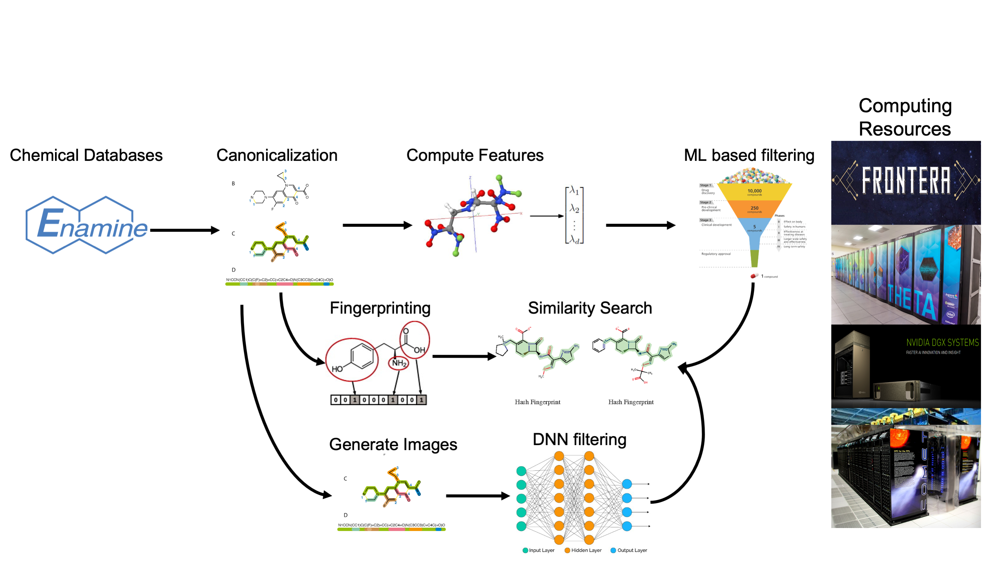

.. 2019-nCoV Data documentation master file, created by
   sphinx-quickstart on Sat Mar  7 16:44:25 2020.
   You can adapt this file completely to your liking, but it should at least
   contain the root `toctree` directive.

Velocity: The AI- and HPC-enabled Lead Generation for SARS-CoV-2 Data Repository
===================

The Velocity repository is for sharing data and models used and/or produced by the project. 
These data will be updated regularly as the collaboration produces new results.
Shared data are `located on the ALCF Petrel data store <https://app.globus.org/file-manager?origin_id=a386b552-6086-11ea-9688-0e56c063f437&origin_path=%2F>`_, 
from where they can be retrieved via Globus (**to request access, follow** 
`this link <https://app.globus.org/groups/ebcae90a-60c9-11ea-a443-0a990c2810ad/about>`_). 

Data Pipeline
==================

Collected Datasets
===================
The following datasets have been collected and made available on Petrel for easy access.
We are working on a combined database covering all molecules from these datasets.

=========== ============= ====== ===========
Dataset     #SMILES       Size   Location(s)
=========== ============= ====== ===========
ChEMBL      1,870,462     103 MB `Petrel <https://app.globus.org/file-manager?origin_id=a386b552-6086-11ea-9688-0e56c063f437&origin_path=%2Fdatabases%2FChEMBL%2F>`_
DrugBank    9,679         664 KB `Petrel <https://app.globus.org/file-manager?origin_id=a386b552-6086-11ea-9688-0e56c063f437&origin_path=%2Fdatabases%2FDrugBank%2F>`_
eMolecule   22,318,616    830 MB version 2019-04-01 `Petrel <https://app.globus.org/file-manager?origin_id=a386b552-6086-11ea-9688-0e56c063f437&origin_path=%2Fdatabases%2FeMolecules%2F>`_
ENAMIN_REAL >1.2B         32 GB  20 zip file `Petrel <https://app.globus.org/file-manager?origin_id=a386b552-6086-11ea-9688-0e56c063f437&origin_path=%2Fdatabases%2FENAMIN_REAL%2F>`_ (`source <https://enamine.net/library-synthesis/real-compounds/real-database>`_), `deduplicated <https://app.globus.org/file-manager?destination_id=a386b552-6086-11ea-9688-0e56c063f437&destination_path=%2Fdatabases%2FENAMIN_REAL%2F>`_
GDB-13      977,468,301   2.7 GB `Petrel <https://app.globus.org/file-manager?origin_id=a386b552-6086-11ea-9688-0e56c063f437&origin_path=%2Fdatabases%2FGDB-13%2F>`_
GDB-17      50,000,000    1.5 GB `Petrel <https://app.globus.org/file-manager?origin_id=a386b552-6086-11ea-9688-0e56c063f437&origin_path=%2Fdatabases%2FGDB-17%2F>`_
HOPV15      350           27 KB  `Petrel <https://2019-ncov.e.globus.org/databases/HOPV15/smiles.txt>`_
Moses       1,936,963     81 MB  `Petrel <https://2019-ncov.e.globus.org/databases/Moses/dataset_v1.csv>`_
PubChem     97,584,282    925 MB pubcehm_canonical.tar.gz `Box <https://anl.app.box.com/file/631539842091>`_, `Petrel <https://app.globus.org/file-manager?origin_id=a386b552-6086-11ea-9688-0e56c063f437&origin_path=%2Fdata%2Fsmiles>`_
SureChEMBL* 291,525,153   35 GB  `Petrel <https://app.globus.org/file-manager?origin_id=a386b552-6086-11ea-9688-0e56c063f437&origin_path=%2Fdatabases%2FSureChEMBL%2F>`_
QM9         133,885       319 MB `Petrel <https://2019-ncov.e.globus.org/databases/QM9/dsgdb9nsd.xyz.tar>`_
REP         10,148        519 KB `Petrel <https://2019-ncov.e.globus.org/databases/REP/smiles.txt>`_
SAVI        283,194,319   989 GB `Petrel <https://app.globus.org/file-manager?origin_id=a386b552-6086-11ea-9688-0e56c063f437&origin_path=%2Fdatabases%2FSAVI%2F>`_
ZINC        21,957,636    1.3 GB `Petrel <https://2019-ncov.e.globus.org/databases/ZINC/index.html>`_
ZINC15      1,475,876,222 92 GB  `Petrel <https://app.globus.org/file-manager?origin_id=a386b552-6086-11ea-9688-0e56c063f437&origin_path=%2Fdatabases%2FZINC15%2F>`_, `deduplicated <https://app.globus.org/file-manager?destination_id=a386b552-6086-11ea-9688-0e56c063f437&destination_path=%2Fdatabases%2FZINC15%2F>`_
ZINC15_3D   NA            NA     `Petrel <https://app.globus.org/file-manager?origin_id=a386b552-6086-11ea-9688-0e56c063f437&origin_path=%2Fdatabases%2FZINC15_3D%2F>`_
=========== ============= ====== ===========

*Note: The SureChEMBL numbers are way off. In fact there are just 18M SMILEs, and not all are unique.

Computed descriptors
===================

============ ======== ============ ======== ============
Dataset      #SMILES  Size         #Files   Location(s)
============ ======== ============ ======== ============
enaDB        310,682  0.1GB                 `Petrel <https://app.globus.org/file-manager?origin_id=a386b552-6086-11ea-9688-0e56c063f437&origin_path=%2Fdata%2Fdescriptors%2Fena15m_descriptors%2F>`_
ena15m       15M      116GB        1,555    `Petrel <https://app.globus.org/file-manager?origin_id=a386b552-6086-11ea-9688-0e56c063f437&origin_path=%2Fdata%2Fdescriptors%2Fena15m_descriptors%2F>`_ (`manifest <https://app.globus.org/file-manager?origin_id=a386b552-6086-11ea-9688-0e56c063f437&origin_path=%2Fdata%2Fdescriptors%2Fena15m_descriptors%2Fmanifest%2F>`_)
pubchem      97M      726GB        9,755    `Petrel <https://app.globus.org/file-manager?origin_id=a386b552-6086-11ea-9688-0e56c063f437&origin_path=%2Fdata%2Fdescriptors%2Fpubchem128_descriptors%2F>`_
Enamine_REAL >1.2B    8.55TB       120,694  `Petrel <https://app.globus.org/file-manager?origin_id=a386b552-6086-11ea-9688-0e56c063f437&origin_path=%2Fdata%2Fdescriptors%2FEnamine_Real_Descriptors%2F>`_ (`manifest <https://app.globus.org/file-manager?origin_id=a386b552-6086-11ea-9688-0e56c063f437&origin_path=%2Fdata%2Fdescriptors%2FEnamine_Real_Descriptors%2Fmanifest%2F>`_)
GDB-13       977M     7.24TB       97,739   `Petrel <https://app.globus.org/file-manager?origin_id=a386b552-6086-11ea-9688-0e56c063f437&origin_path=%2Fdata%2Fdescriptors%2FGDB-13_descriptors%2F>`_
ZINC15       >1.4B    10.98TB      147,137  `Petrel <https://app.globus.org/file-manager?origin_id=a386b552-6086-11ea-9688-0e56c063f437&origin_path=%2Fdata%2Fdescriptors%2FZinc15_descriptors%2F>`_ (`manifest <https://app.globus.org/file-manager?origin_id=a386b552-6086-11ea-9688-0e56c063f437&origin_path=%2Fdata%2Fdescriptors%2FZinc15_descriptors%2Fmanifest%2F>`_)
SureChEMBL   291M     133GB        1,792    `Petrel <https://app.globus.org/file-manager?origin_id=a386b552-6086-11ea-9688-0e56c063f437&origin_path=%2Fdata%2Fdescriptors%2FSureChEMBL_descriptors%2F>`_
============ ======== ============ ======== ============

Note: "enaDB" is 310,682 ENA+Databank SMILES strings plus computed descriptors; 95 missing are `listed here <https://app.globus.org/file-manager?origin_id=a386b552-6086-11ea-9688-0e56c063f437&origin_path=%2Fdata%2F>`_.

Molecular Fingerprints
===================

============ =========
enaDB        TBA
ena15m       `Petrel <https://app.globus.org/file-manager?origin_id=a386b552-6086-11ea-9688-0e56c063f437&origin_path=%2Fdata%2FFingerprints%2FEnamine_REAL_diversity_set_15.5M%2F>`_
pubchem      `Petrel <https://app.globus.org/file-manager?origin_id=a386b552-6086-11ea-9688-0e56c063f437&origin_path=%2Fdata%2FFingerprints%2Fpubchem%2F>`_
Enamine_REAL TBA
ZINC15       TBA
SureChEMBL   `Petrel <https://app.globus.org/file-manager?origin_id=a386b552-6086-11ea-9688-0e56c063f437&origin_path=%2Fdata%2FFingerprints%2FSureChEMBL%2F>`_
============ =========

Top ML-Predictions
===================

The following table provides links to lists of drug candidates that our ML models 
score in the top 1% for several targets,and on what datasets the drugs come from. 
We have developed two primary models a binning model and a regressor model. The 
binning model XYZ, and the regressor model XYZ The `intersection` label are the drugs 
that scored in the top 1% under both binning models and the regressor models. 
(All links are to locations on Petrel)

 ====================== ============== ====================
 Target and Model       Dataset        Predictions by date
 3CLpro binner          ENAMIN_REAL    `March 17 <https://2019-ncov.e.globus.org/incoming/top1/Enamine_Infer_3CLpro.bin.top1.csv>`_
 3CLpro regressor       ENAMIN_REAL    `March 17 <https://2019-ncov.e.globus.org/incoming/top1/Enamine_Infer_3CLpro.reg.top1.csv>`_
 3CLpro intersection    ENAMIN_REAL    `March 17 <https://2019-ncov.e.globus.org/incoming/top1/Enamine_Infer_3CLpro.top1.intersection.csv>`_
 ADRP-P1 binner         ENAMIN_REAL    `March 17 <https://2019-ncov.e.globus.org/incoming/top1/Enamine_Infer_ADRP-P1.bin.top1.csv>`_
 ADRP-P1 regressor      ENAMIN_REAL    `March 17 <https://2019-ncov.e.globus.org/incoming/top1/Enamine_Infer_ADRP-P1.reg.top1.csv>`_
 ADRP-P1 intersection   ENAMIN_REAL    `March 17 <https://2019-ncov.e.globus.org/incoming/top1/Enamine_Infer_ADRP-P1.top1.intersection.csv>`_
 ====================== ============== ====================

Top Docking Hits
===================

We currently have hits for `vww`, `ADRP`, `ADRP-ADPR`, `CoV`, `Nsp10`, `nsp-15-CIT`, and `PLPro`. The data are organized by date `here <https://app.globus.org/file-manager?origin_id=a386b552-6086-11ea-9688-0e56c063f437&origin_path=%2FBoxMirror%2Fdrug-screening%2FTop-docking-hits%2F>`_.

Toxicology
----------
Toxicology assessment is incorporated in the screening pipeline using a neural network model
trained on the Tox21 dataset. ### Logan can you add more description here?

============================================ =========== =========== ================================= =============
Dataset                                      Author      Size        Checksum                          Location(s)
============================================ =========== =========== ================================= =============
ena+db.can.uniq.csv.bsep.scaffold.class      Brettin     341.41MB    9d1441d895b43f7c7f8a740d4b2aedaf  `Petrel <https://app.globus.org/file-manager?origin_id=a386b552-6086-11ea-9688-0e56c063f437&origin_path=%2Fdata%2Ftoxicology%2F>`_
ena+db_tox21_screening.csv                   Ward        84MB        89c442d16415fa145a0fb4e112d323c7  `Petrel <https://app.globus.org/file-manager?origin_id=a386b552-6086-11ea-9688-0e56c063f437&origin_path=%2Fdata%2Ftoxicology%2Ftox21-screen-results%2F>`_
============================================ =========== =========== ================================= =============

ML Docking
===================

Related Globus Endpoints
===================

When using `Globus <https://app.globus.org>`_, these endpoint names may be useful:

* `2019-nCoV <https://app.globus.org/file-manager?origin_id=a386b552-6086-11ea-9688-0e56c063f437&origin_path=%2F>`_: ALCF Petrel server, where the data listed below are to be found
* `alcf#dtn_mira <https://app.globus.org/file-manager?origin_id=e09e65f5-6d04-11e5-ba46-22000b92c6ec>`_: ALCF file systems, including Theta file system space at `/lus/theta-fs0/projects` (with 12 data transfer nodes [DTNs], better than endpoint `alcf#dtn_theta <https://app.globus.org/file-manager?origin_id=08925f04-569f-11e7-bef8-22000b9a448b>`_, which only has one)
* `anl#lambda0 <https://app.globus.org/file-manager?origin_id=8715e4f0-1d34-11ea-9705-021304b0cca7&origin_path=%2Flambda_stor%2Fdata%2F>`_: Argonne Lambda machine
* `anl#mllab <https://app.globus.org/file-manager?origin_id=2535d252-21ac-11e8-b75c-0ac6873fc732&origin_path=%2F~%2F>`_: Washington, Everett, nucleus

`Get help setting up a Globus endpoint. <https://www.globus.org/globus-connect>`_

Screen Sets
===================

Our researchers have put together datasets of molecules to screen. The molecules are taken from literature and matched to molecules in datasets by similarity search. The `.csv` files come in the following format: ``Dataset_source, score, target_canonical_smile, match_canonical_smile``.

* `literature matches in the ENAMIN_REAL dataset <https://2019-ncov.e.globus.org/data/Top_Similar_Hits/top_100_similar_1000_targets/Enamine_Real_ben_literature_target_1000_targets_top_100_similar.top_100.csv>`_
* `literature matches in the GDB-13 dataset <https://2019-ncov.e.globus.org/data/Top_Similar_Hits/top_100_similar_1000_targets/GDB13_ben_literature_target_1000_targets_top_100_similar.top_100.csv>`_

How do I upload data to the site?
===================

1. Upload the data to the ``/incoming/`` folder on the ALCF Petrel datastore (`here <https://app.globus.org/file-manager?origin_id=a386b552-6086-11ea-9688-0e56c063f437&origin_path=%2Fincoming%2F>`_).
2. Post on the ``#data-incoming`` channel on Slack. *Make sure to provide a description of the data in a* ``README`` *or in the message you post to the slack.*
3. A data librarian will move the data to a permanent place on the Globus endpoint and update the website with a link to the data and the description.

Pending

Data Access and Upload Via Box
===================

*Argonne IT and cybersecurity have recently set up a Globus endpoint that interfaces
 directly with Box (i.e., data are replicated in both directions). 
 Using this capability will require you to have an Argonne login and access to the 2019 nCoV Box folder.
 * You can access it `here <https://app.globus.org/file-manager?origin_id=e0815163-39cf-4107-a8de-46310df195dc&origin_path=%2F>`_

Some files are `located on Argonne Box <https://anl.app.box.com/folder/105432421864>`_, 
but require Argonne credentials. There is also a read only copy of the Box data in ALCF Petrel 
data store, under the ``/BoxMirror/`` `directory <https://app.globus.org/file-manager?origin_id=a386b552-6086-11ea-9688-0e56c063f437&origin_path=%2FBoxMirror%2F>`_, 
which is also replicated to ``/theta_projects/CVD_Research/BoxMirror`` on Theta.
These mirrors update approximately every hour from the data in Box.

