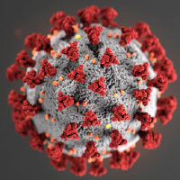

.. 2019-nCoV Data documentation master file, created by
   sphinx-quickstart on Sat Mar  7 16:44:25 2020.
   You can adapt this file completely to your liking, but it should at least
   contain the root `toctree` directive.

Overview of the Argonne Led Coronavirus Computing Effort
==========================================

Rick Stevens (Argonne National Laboratory, POC)

Argonne is leading and coordinating five related computational efforts aimed at improving our understanding of the SARS-nCoV-2 virus, the associated COVID-19 disease, and accelerating the development of treatment options including antiviral drugs and vaccines.   This computational effort complements the experimental laboratory efforts at Argonne and elsewhere.  The overall effort includes team members from multiple laboratories (Argonne and Brookhaven) multiple universities (University of Chicago, University of Illinois, Discovery Partners Institute, University of Virginia, Rutgers University and George Mason University) and private research centers (JC Venter Institute).   

This site is based on the X-ray Tomography Data Bank or TomoBank, provides a repository of experimental 
and simulated data sets with the aim to foster collaboration among computational scientists, 
beamline scientists and experimentalists, to accelerate the development of tomographic 
reconstruction and 3D visualization methods and to speed up their implementation in the various 
synchrotron facility data analysis software packages.

Content
-------

.. toctree::
   :maxdepth: 1

   data
   about

Indices and tables
==================

* :ref:`genindex`
* :ref:`modindex`
* :ref:`search`
